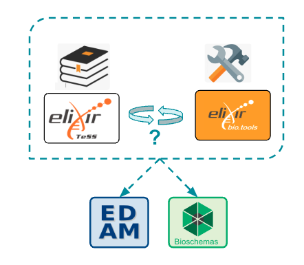

## Project abstract {#project-abstract}

Systems biology (SB) is a new ELIXIR Community, utilising different ELIXIR resources, such as the Training eSupport System (TeSS) and bio.tools, a registry of software tools and data resources for life sciences. One of the main initial objectives of the SB Community is to create a SB-themed domain hosted by TeSS, encompassing SB-related ELIXIR services and events, in a fully automated way.

Most content in TeSS is sourced through automated aggregation (“scraping”) of external sources containing resources marked up with semantic metadata, like Bioschemas. Currently, TeSS cannot recognize references to bio.tools identifiers from a Bioschemas-annotated resource, so the number of resources linked to bio.tools is relatively low.

In this project, TeSS’ Bioschemas parser will be extended to recognize bio.tools identifier references, and documentation produced advising training resource maintainers how they can add these references to their Bioschemas markup. In collaboration with TeSS and bio.tools, we will focus on selected SB disciplines from the priority areas of the SB Community to integrate and cross-link related ELIXIR products - training events, training materials, computational and bioinformatics tools, databases and services from the bio.tools registry.

This will be achieved using suitable ontologies identified by the SB community and by careful curation of SB-related materials. We aim to extend this work to other ELIXIR products such as lists of trainers, related ELIXIR Innovation and Industry events and publications. This will serve as a pilot project leading to broader integration with other SB disciplines, and will be of interest to several other ELIXIR Communities.

### Keywords {#keywords}

Systems Biology, Bio-Ontologies, FAIR science, … 

## Introduction {#introduction}

### Background {#background}

* Systems biology (SB) is a new ELIXIR Community
* ELIXIR resources
    * Training eSupport System (TeSS) 
    * Bio.tools
* Semantic metadata
    * Bioschemas
    * EDAM ontology

### Problematics {#problematics}

Findability of materials and events in SB

* TeSS
    * Uses user input and scrapers for a number of resources (detail ref)
    * Missing events
    * Events with incomplete annotation
        * From user input: can add terms and annotation upon creating entry
        * From scrapers: resources may or may not use thorough markup annotations
    * Random user cannot edit entry
* Bio.tools
    * User input and scrapers (detail)
    * Missing tools
    * Incomplete annotation
        * due to lack of relevant term in EDAM
        * due to minimal annotation of tools upon adding them despite recommendation (ref bio.tools user guide)
        * Lack of markup in the case of entries from scraping 
    * User can request editing rights to a given entry

### Objectives {#objectives}

Facilitate users’ search for courses/events in the fields of systems biology

The short-term goal is to conduct a pilot study at the Biohackathon, the long-term goal is to extend the automated frame-work to other SB-related ELIXIR domains and services. (1) Adapting ontologies and explore ontology mappings (e.g., between EDAM and SBO), to annotate SB-related products by a set of controlled and relational vocabularies. (2) Using selected SB disciplines and related TeSS and bio.tools products (training events, training materials, computational, bioinformatics tools, databases, services), to integrate TeSS and bio.tools by extending TeSS’ Bioschemas parser. We will aim to explore: (3) Compliance with FAIR principles. (4) Extension to other ELIXIR resources.

### Strategy {#strategy}

**Proposed strategy**:

1. Semantics model to connect events and materials (EDAM, TESS, BT…)
2. Use cases (selected SB courses, topics, tools, relevant search terms…)
3. Edam curation (and other SB-specific ontologies like SBO…) 
4. Gap identification in TeSS and bio.tools

## Biohackathon results {#biohackathon-results}

### 1. Semantics model

How can TeSS and bio.tools be connected through Bioschemas:

* Use of/addition of SB-specific terms in EDAM (developers-dependent) 
* Use of markup annotations provided by Bioschemas (content makers-dependent)

**Figure 1.** A. Events and tools from TeSS and bio.tools could be connected through the implementation of Bioschemas markup and the use of the EDAM ontology, however the process is currently not straightforward. B. Detailed semantics model of the connections available. 

### 2. Definition of use cases

#### Courses {#courses}

Systems biology target events or courses (Table 1).

| Type of event | Event name                                                 | Original course url                                                                                | TeSS url                                                                                                                                     | … |
| ------------- | ---------------------------------------------------------- | -------------------------------------------------------------------------------------------------- | -------------------------------------------------------------------------------------------------------------------------------------------- | - |
| Course        | Systems biology: from large datasets to biological insight | [link](https://www.ebi.ac.uk/training/events/systems-biology-large-datasets-biological-insight-2/) | [link](https://tess.elixir-europe.org/events/systems-biology-from-large-datasets-to-biological-insight-a32ab30e-f479-4d14-9a12-20000161d99f) | … |
| Course        | Integrative analysis of multi-omics data                   | [link](https://www.embl.org/about/info/course-and-conference-office/events/mmd24-01/)              | none                                                                                                                                         | … |

**Table 1.** 

#### Keywords {#keywords}

List potentially relevant keywords (specific to the field or not) for a user to search for courses or training materials in systems biology (Table 2).

| ------------------------ | ------------------ | ---------------- | ----------------- |
| machine learning         | network analysis   | data management  | logic modelling   |
| deep learning            | open science       | data integration | single cell omics |
| dimensionality reduction | data heterogeneity | multi omics      | Cytoscape         |
| MOFA2                    | Seurat             | mixOmics         | cosmosR           |
| CellNOptR                | MuVi               | CytoCopteR       | …                 |

**Table 2. ** List of keywords a user may use in order to search for target courses. 

### 3. Curation of ontologies 

* Investigating systems biology-specific ontologies
    * Which are they: SBO, MAMO …
    * List relevant entries or concepts
* Revising the EDAM ontology / Populating the SB branch of the EDAM ontology 
    * Are the target keywords present and thoroughly described (Table 2)?

### 4. Knowledge gap: immediate improvements

#### EDAM {#edam}

* Addition/edition of terms in EDAM (Table 3)
    * Gather information relevant to target terms: concise definition, URL, synonyms, etc.
    * Edit existing terms to add relevant attributes.
    * Add terms that are not yet there. Given the case, add link to external ontologies
| Label                    | in EDAM                                                                                    | Sub-ontology in EDAM | Parent in EDAM                                           | Def                    | Attributes                                    |
| ------------------------ | ------------------------------------------------------------------------------------------ | -------------------- | ----------------------------------------------------------- | ---------------------- | --------------------------------------------- |
| machine learning         | [yes](https://edamontology.github.io/edam-browser/#http://edamontology.org/topic_3474)     | Topic                |                                                             |                        |                                               |
| deep learning            | no                                                                                         | Topic                | [Machine learning](http://edamontology.org/topic_3474)      | (from EDAM-BioImaging) |                                               |
| dimensionality reduction | [yes](https://edamontology.github.io/edam-browser/#http://edamontology.org/operation_3935) | Operation            |                                                             |                        | hasTopic Machine Learning                     |
| logic modelling          | no                                                                                         | Data                 | [Mathematical modelling](http://edamontology.org/data_0950) | (from MAMO)            | hasSynonym algebraic logic model, logic model |
| single-cell omics        | no                                                                                         | Topic                | [Omics](http://edamontology.org/topic_3391)                 | (new)                  | hasSynonym Single-cell multi-omics            |

**Table 3. **Selection of keywords that may be used for a user to search for SB courses or training materials in TeSS, and their attributes. Those terms were added and/or annotated appropriately following our objectives and semantics model.

#### bio.tools {#bio-tools}

* Addition/edition of tools in bio.tools (Table 4)
    * Annotation of tools with EDAM terms
    
| Tool      | In BT                              | Topic (EDAM) applicationSubCategory (BT) | Operation (EDAM) featureList (BT)         | Data (EDAM)

input/output (BT)                 | URL                                           |
| --------- | ---------------------------------- | ------------------------------------------- | -------------------------------------------- | ---------------------------------------------- | --------------------------------------------- |
| Cytoscape | [Yes](https://bio.tools/cytoscape) | Systems Biology, (Bioinformatics)        | Network analysis, (Network visualisation) | ...                                            | …                                             |
| Seurat    | [Yes](https://bio.tools/seurat)    | Transcriptomics, (Single-cell omics)     | Data integration                             | RNA sequence, Clustered expression profiles | …                                             |
| MOFA2     | No                                 | Multi-omics                                 | Data integration                             | ...                                            | [link](https://biofam.github.io/MOFA2/) |

**Table 4.** A selection of tools that were added or further annotated in bio.tools.

#### TeSS {#tess}

* Addition of event in TeSS (Table 5)
    * Annotation of EDAM terms
    * Annotation of tools used in courses

| Type   | Event name                                                 | URL in TeSS | Terms                | Tools                    |
| ------ | ---------------------------------------------------------- | ----------- | -------------------- | ------------------------ |
| Course | Systems biology: from large datasets to biological insight | …           | …                    | …                        |
| Course | Integrative analysis of multi-omics data                   | link        | (EDAM tags) | (biotools tags) |

**Table 5.** (from use cases) A new course was added to TeSS’ catalogue and properly annotated using relevant keywords and following the semantics model (see Figure 1B).

The addition of these terms and annotations across the EDAM-bio.tools-TeSS ecosystem allows us to connect tools and courses through our semantic model, thus facilitating users’ search for appropriate courses and training material in the field of systems biology (Figure 2).

{width=90%}

**Figure 2.** Bioschemas provide specifications for markup annotations of a variety of resources (tools, training materials, ...) and makes use of a standard, controlled vocabulary through the EDAM ontology.

In a wider fashion, the adoption of detailed markup annotations as recommended guidelines will contribute to a mutual enrichment among ELIXIR platforms as well as their content providers, via bidirectional metadata scraping.

## Discussion / perspectives / guidelines {#discussion-perspectives-guidelines}

### Content annotation  {#content-annotation}

* Ontology terms suggestions should be extracted from abstract or other descriptive text about tools (bio.tools) or materials (TeSS).
* Suggested terms should be manually confirmed/validated/corrected by the curator.
* Additional terms can be provided manually by the curator.
* Allow users to edit entries in TeSS ? (many events lack annotations)

### Content search {#content-search}

* Ontology term(s) can be selected from different ontologies (autocomplete …). Multiple terms can be connected with Boolean operators. Boolean expressions are used for search.
* Can Regular expressions be used too?
* Used search expressions can be saved or edited for more advanced searches.

### Navigation across platforms  {#navigation-across-platforms}

#### From bio.tools to TeSS {#from-bio-tools-to-tess}

Enable browsing on found tools in bio.tools and provide links that will search with the same terms on TeSS (Figure 3A).

#### From TeSS to bio.tools {#from-tess-to-bio-tools}

Enable browsing on found materials in TeSS and provide links that will search with the same terms on bio.tools (Figure 3B).

#### To other ontologies {#to-other-ontologies}

Search linking to ontologies or semi-refill search to nearest terms (?)

{width=90%}

{width=90%}

**Figure 3.** A. From bio.tools to TeSS. B. From TeSS to bio.tools.

## Acknowledgements {#acknowledgements}

(*) This work was performed during the ELIXIR BioHackathon Europe 2023 organised by ELIXIR in November 2023. 

(CR) L'Institut Français de Bioinformatique (IFB) a été fondé par le Programme d'Investissements d'Avenir subventionné par l'Agence Nationale de la Recherche, numéro ANR-11-INBS-0013.

## Resources {#resources}

[Links to software (e.g., GitHub or Jupyter Notebooks) and data repositories created or developed during the event]

## References {#references}

Ref Bioschemas

Ref EDAM

…

#### Citation Typing Ontology annotation

You can use [CiTO](http://purl.org/spar/cito/2018-02-12) annotations, as explained in [this BioHackathon Europe 2021 write up](https://raw.githubusercontent.com/biohackrxiv/bhxiv-metadata/main/doc/elixir_biohackathon2021/paper.md) and [this CiTO Pilot](https://www.biomedcentral.com/collections/cito).
Using this template, you can cite an article and indicate _why_ you cite that article, for instance DisGeNET-RDF [@citesAsAuthority:Queralt2016].

The syntax in Markdown is as follows: a single intention annotation looks like
`[@usesMethodIn:Krewinkel2017]`; two or more intentions are separated
with colons, like `[@extends:discusses:Nielsen2017Scholia]`. When you cite two
different articles, you use this syntax: `[@citesAsDataSource:Ammar2022ETL; @citesAsDataSource:Arend2022BioHackEU22]`.

Possible CiTO typing annotation include:

* citesAsDataSource: when you point the reader to a source of data which may explain a claim
* usesDataFrom: when you reuse somehow (and elaborate on) the data in the cited entity
* usesMethodIn
* citesAsAuthority
* citesAsEvidence
* citesAsPotentialSolution
* citesAsRecommendedReading
* citesAsRelated
* citesAsSourceDocument
* citesForInformation
* confirms
* documents
* providesDataFor
* obtainsSupportFrom
* discusses
* extends
* agreesWith
* disagreesWith
* updates
* citation: generic citation
