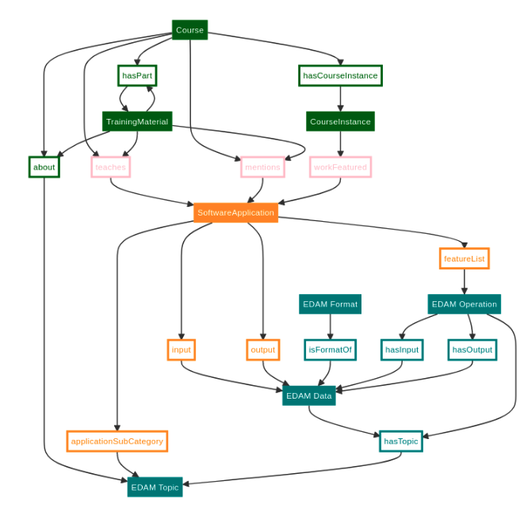
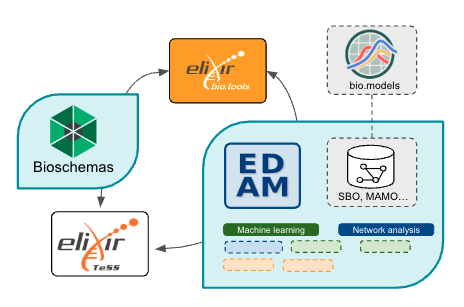

## Abstract

Systems biology (SB) is a new ELIXIR Community, utilizing different ELIXIR resources, such as the Training eSupport System (TeSS) and bio.tools, a registry of software tools and data resources for life sciences. One of the main initial objectives of the SB Community is to create a SB-themed domain hosted by TeSS, encompassing SB-related ELIXIR services and events, in a fully automated way.

Most content in TeSS is sourced through automated aggregation (“scraping”) of external sources containing resources marked up with semantic metadata, like Bioschemas. Currently, TeSS cannot recognize references to bio.tools identifiers from a Bioschemas-annotated resource, so the number of resources linked to bio.tools is relatively low.

In this project, TeSS’ Bioschemas parser will be extended to recognize bio.tools identifier references, and documentation produced advising training resource maintainers how they can add these references to their Bioschemas markup. In collaboration with TeSS and bio.tools, we will focus on selected SB disciplines from the priority areas of the SB Community to integrate and cross-link related ELIXIR products - training events, training materials, computational and bioinformatics tools, databases and services from the bio.tools registry.

This will be achieved using suitable ontologies identified by the SB community and by careful curation of SB-related materials. We aim to extend this work to other ELIXIR products such as lists of trainers, related ELIXIR Innovation and Industry events and publications. This will serve as a pilot project leading to broader integration with other SB disciplines, and will be of interest to several other ELIXIR Communities.

The short-term goal is to conduct a pilot study at the Biohackathon, the long-term goal is to extend the automated frame-work to other SB-related ELIXIR domains and services. (1) Adapting ontologies and explore ontology mappings (e.g., between EDAM and SBO), to annotate SB-related products by a set of controlled and relational vocabularies. (2) Using selected SB disciplines and related TeSS and bio.tools products (training events, training materials, computational, bioinformatics tools, databases, services), to integrate TeSS and bio.tools by extending TeSS’ Bioschemas parser. We will aim to explore: (3) Compliance with FAIR principles. (4) Extension to other ELIXIR resources.

Keywords: Systems Biology, Bio-Ontologies, FAIR science, (other...)

## Introduction

Background: ELIXIR resources TeSS, biotools, Bioschemas…

Aim: Facilitate users’ search for courses/events in the fields of systems biology

Proposed strategy:

1. Semantics model to connect events and materials (EDAM, TESS, BT…)
2. Use cases (selected SB courses, topics, tools, relevant search terms…)
3. Edam curation (and other SB-specific ontologies like SBO…) 
4. Gap identification in TeSS and bio.tools

## Biohackathon results

### Semantics model
How can TeSS and bio.tools be connected through Bioschemas:

* Use of/addition of SB-specific terms in EDAM (developers-dependent) 
* Use of markup annotations provided by Bioschemas (content makers-dependent)

### Definition of use cases

Systems biology courses and/or events, keywords, etc (Table 1)

| Type of event | Event name                                                 | Original course url                                                                                                                                                                      | … |  |
| ------------- | ---------------------------------------------------------- | ---------------------------------------------------------------------------------------------------------------------------------------------------------------------------------------- | - |  |
| Course        | Systems biology: from large datasets to biological insight | [https://www.ebi.ac.uk/training/events/systems-biology-large-datasets-biological-insight-2/](https://www.ebi.ac.uk/training/events/systems-biology-large-datasets-biological-insight-2/) | … |  |
| Course        | Integrative analysis of multi-omics data                   | [https://www.embl.org/about/info/course-and-conference-office/events/mmd24-01/](https://www.embl.org/about/info/course-and-conference-office/events/mmd24-01/)                           | … |  |

Table 1. (from spreadsheet [here](https://docs.google.com/spreadsheets/d/1kE4rnoOxE1P28VdGh6CRqtC4jWQKKeSN/edit?usp=sharing&ouid=118442261765724734713&rtpof=true&sd=true))

### Curation of ontologies 

Select ontologies: EDAM, SBO, MAMO …

1. Connect SysBio ontologies to EDAM
    * List of terms to be connected (careful with unique and persistent identifiers) (Table 2)
    * ...
    
2. Populate the SB branch of the EDAM ontology 
    * List of terms to be added and basic attributes (description, URL, etc) (Table 2)
    * Synonyms to be added to existing terms
| Keyword                  | Concise definition | Sub-ontology in EDAM | Link to EDAM URI                                                                                                                                                           | Link to OLS URI1                                    | … |
| ------------------------ | ------------------ | -------------------- | -------------------------------------------------------------------------------------------------------------------------------------------------------------------------- | --------------------------------------------------- | - |
| data management          |                    | Topic                | [http://edamontology.org/topic_0091](http://edamontology.org/topic_0091)                                                                                                   | NA                                                  | … |
| dimensionality reduction |                    | Operation            | [https://edamontology.github.io/edam-browser/#http://edamontology.org/operation_3935](https://edamontology.github.io/edam-browser/#http://edamontology.org/operation_3935) | NCIT:C176231, OBI:0002587, OMIT:0001480, topic:3474 | … |
| machine learning         |                    | Topic                | [https://edamontology.github.io/edam-browser/#http://edamontology.org/topic_3474](https://edamontology.github.io/edam-browser/#http://edamontology.org/topic_3474)         |                                                     | … |
| deep learning            |                    | Topic                |                                                                                                                                                                            |                                                     | … |
| data integration         | Process to join …  | Topic                |                                                                                                                                                                            |                                                     | … |

Table 2. (extract from spreadsheet [here](https://docs.google.com/spreadsheets/d/1kE4rnoOxE1P28VdGh6CRqtC4jWQKKeSN/edit?usp=sharing&ouid=118442261765724734713&rtpof=true&sd=true))

### Gap identification in TeSS & bio.tools

> TO DO

| Tools name | Bio.tools link                                             | Tool link                                                                                | … |
| ---------- | ---------------------------------------------------------- | ---------------------------------------------------------------------------------------- | - |
| MOFA2      |                                                            | [https://biofam.github.io/MOFA2/](https://biofam.github.io/MOFA2/)                       | … |
| Cytoscape  | [https://bio.tools/cytoscape](https://bio.tools/cytoscape) |                                                                                          | … |
| CellNOptR  | [https://bio.tools/cellnoptr](https://bio.tools/cellnoptr) |                                                                                          | … |
| CytoCopteR |                                                            | [https://apps.cytoscape.org/apps/cytocopter](https://apps.cytoscape.org/apps/cytocopter) | … |

Table 3. Tools (from spreadsheet)

## Discussion

> TO DO

## Future developments

> TO DO

## Resources (software, repository, …)

> Links to software (e.g., GitHub or Jupyter Notebooks) and data repositories created or developed during the event

## Acknowledgements

(*) This work was performed during the ELIXIR BioHackathon Europe 2023 organized by ELIXIR in November 2023. (CR) L'Institut Français de Bioinformatique (IFB) a été fondé par le Programme d'Investissements d'Avenir subventionné par l'Agence Nationale de la Recherche, numéro ANR-11-INBS-0013.

## References

Ref Bioschemas

Ref EDAM

...

#### Citation Typing Ontology annotation

You can use [CiTO](http://purl.org/spar/cito/2018-02-12) annotations, as explained in [this BioHackathon Europe 2021 write up](https://raw.githubusercontent.com/biohackrxiv/bhxiv-metadata/main/doc/elixir_biohackathon2021/paper.md) and [this CiTO Pilot](https://www.biomedcentral.com/collections/cito).
Using this template, you can cite an article and indicate _why_ you cite that article, for instance DisGeNET-RDF [@citesAsAuthority:Queralt2016].

The syntax in Markdown is as follows: a single intention annotation looks like
`[@usesMethodIn:Krewinkel2017]`; two or more intentions are separated
with colons, like `[@extends:discusses:Nielsen2017Scholia]`. When you cite two
different articles, you use this syntax: `[@citesAsDataSource:Ammar2022ETL; @citesAsDataSource:Arend2022BioHackEU22]`.

Possible CiTO typing annotation include:

* citesAsDataSource: when you point the reader to a source of data which may explain a claim
* usesDataFrom: when you reuse somehow (and elaborate on) the data in the cited entity
* usesMethodIn
* citesAsAuthority
* citesAsEvidence
* citesAsPotentialSolution
* citesAsRecommendedReading
* citesAsRelated
* citesAsSourceDocument
* citesForInformation
* confirms
* documents
* providesDataFor
* obtainsSupportFrom
* discusses
* extends
* agreesWith
* disagreesWith
* updates
* citation: generic citation
