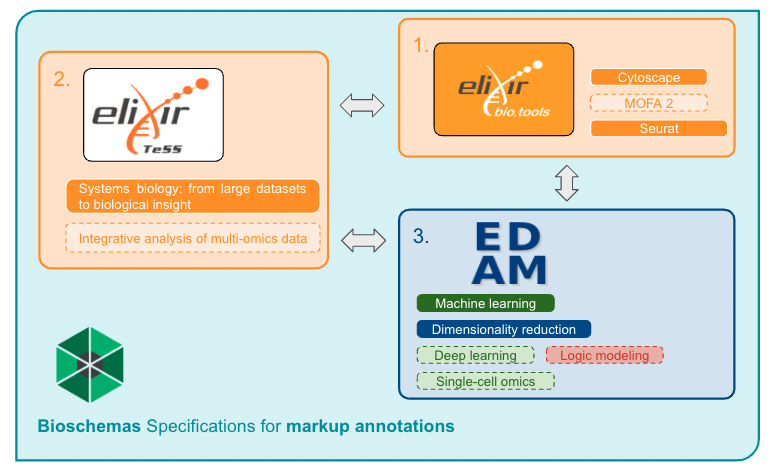

## Project abstract {#project-abstract}

Systems biology (SB) is a new ELIXIR community, that aims to utilise different ELIXIR resources, such as the Training eSupport System (TeSS) and bio.tools, a registry of software tools and data resources for life sciences. One of the main initial objectives of the SB community is to create an SB-themed domain hosted by TeSS, encompassing SB-related ELIXIR services and events, in a fully automated way.

Most content in TeSS is sourced through automated aggregation ("scraping") of external sources containing resources marked up with semantic metadata, like Bioschemas. Currently, TeSS cannot recognize references to bio.tools identifiers from a Bioschemas-annotated resource, so the number of resources linked to bio.tools is relatively low.

In this project, we will focus on selected SB disciplines from the priority areas of the SB Community to integrate and cross-link related ELIXIR products - training events, training materials, computational and bioinformatics tools, databases and services from the bio.tools registry.

This will be achieved using suitable ontologies identified by the SB community and by careful curation of SB-related materials. We aim to extend this work to other ELIXIR products such as lists of trainers, related ELIXIR Innovation and Industry events and publications. This will serve as a pilot project leading to broader integration with other SB disciplines, and will be of interest to several other ELIXIR Communities.

## Introduction {#introduction}

### Background {#background}

The systems biology community is one of the most recently-created ELIXIR Community [@citesAsRelated:Santos_2022], with the aim of answering several infrastructure needs identified by the community. Owing to its very nature, the field of systems biology relies not only on the development and use of modelling tools, but also on data storage solutions and community standards. For these reasons, the SB community set some of its main focuses on the interoperability of systems biology resources and the coordination of capacity building and training resources.

These objectives align within the scope of the ELIXIR Programme and ecosystem, and more specifically with the Training eSupport System (TeSS) [@citesAsAuthority:Beard_2020] and the bio.tools registry [@citesAsAuthority:Ison_2019]. TeSS provides a platform for all sorts of life science-related training events and materials, mostly by aggregating data and metadata from identified content providers by means of HTML scraping, application programming interface (API) integration, and structured-data formats parsing [Schema.org](https://schema.org/) [@usesMethodIn:Guha_2016]. Besides, the project is highly involved in [Bioschemas](https://bioschemas.org/) [@citesAsAuthority:Gray_2017] development, an initiative that aims at building upon Schema.org specifications, while providing better-tailored specification profiles for life sciences at large. The bio.tools platform is a community effort of curation of computational biology tools, answering the need for a consistent and up-to-date registry of existing tools and algorithms across all fields of life sciences. The bio.tools registry, also supported by ELIXIR, currently amounts to almost 30,000 tools, annotated by topics, operations, data formats, and many additional criteria, allowing users to navigate it rather straightforwardly.

The adequate annotation of both tools and training materials available in TeSS and bio.tools is granted and facilitated by using the EDAM ontology [@citesAsAuthority:Black_2021]. EDAM is precisely aimed at standardising terms and definitions for data analysis and management in the context of life sciences and beyond. Its goal is to define a controlled vocabulary to be used for several purposes such as the the semantic annotation and classification of relevant resources. 

### Problem {#problematics}

While the wealth of systems biology resources address interoperability and findability concerns, they often lack standard annotations and consistent metadata coverage. A second potential bottleneck is the absence of adequately fine-tuned EDAM concepts and terms, due to the uneven coverage of certain subdisciplines of biology, as well as the constant evolution of bioinformatics methods and topics deriving from advanced biotechnologies. In particular, the domain of systems biology in EDAM has previously not been populated extensively (beyond data formats and a few main concepts [@citesAsRelated:biosimulators]), partly due to a lack of demand and appropriate expertise (_i.e._ experts interested in contributing).

### Objectives {#objectives}

The overall vision of this project is to better synergise the ELIXIR ecosystem by working towards the integration of finer-grained SB concepts and their use for the annotation of software and training materials relevant to the field, and thus improve their findability and navigability.

The long-term goal is to extend the automated framework to other SB-related ELIXIR domains and services by (1) adapting ontologies and exploring ontology mappings (_e.g._ between EDAM and the Systems Biology Ontology), to annotate SB-related products by a set of controlled and relational vocabularies; (2) using selected SB disciplines and related TeSS and bio.tools products (training events, training materials, computational, bioinformatics tools, databases, services), to integrate TeSS and bio.tools by extending TeSS’ Bioschemas parser; (3) complying with FAIR principles; (4) exploring a possible extension to other ELIXIR resources.To facilitate this, the project conducted a pilot study during this Biohackathon, focusing on assessing the feasibility of the long-term goal more precisely.

### Strategy {#strategy}

In developing this project and evaluating its feasibility, we undertook a step-by-step approach involving several key tasks needed to design the foreseen product.
We initiated the process by identifying specific use cases, spanning various systems biology courses, relevant topics, tools, and search terms. This user-centred design approach provided insights into the requirements needed to refine our method and align it with our objectives.

Simultaneously, we implemented a data model utilising resources like EDAM, TeSS, and bio.tools. This allowed us to assess the availability and adequacy of metadata for representing and connecting different elements within the domain, such as events, materials, and software.

Furthermore, we focused on identifying ontologies needed to properly describe SB resources, particularly refining the EDAM ontology and other specialised ontologies like the Systems Biology Ontology. This ensured the provision of an accurate and consistent representation of available information, thus strengthening the effectiveness of our approach.

Additionally, we conducted a thorough analysis to identify any existing gaps in platforms like TeSS and bio.tools. This analysis served to guide improvements to these platforms, enhancing their usability and relevance for users in the field of systems biology.

## BioHackathon results {#biohackathon-results}

### 1. Semantic model

Most of the ELIXIR resources that serve the contents we aim to connect provide interoperable metadata using Schema.org, Bioschemas, and EDAM. We surveyed here how these metadata standards can enable the representation of the information necessary to describe different resources (_e.g._ software, training materials) so that they can be searched and connected. 

To enhance the findability and navigation of SB resources, the first step was to connect TeSS and bio.tools entries using schema.org markup annotations and establish a semantic model for interoperability (Figure 1). 

{width=100%}

Although the connection is functionally feasible, in practice it relies on the proper use of markup annotations, as recommended by the FAIR Guiding Principles. Specifically, it demands ongoing efforts to utilize, develop, and sustain a systems biology vocabulary within the EDAM ontology (developer-dependent), while also necessitating efforts to maximize the utilization of markup annotations offered by Bioschemas (content maker-dependent).

### 2. Definition of use cases

#### Courses {#courses}

**Table 1.** List of systems biology target events or courses.

| Type of event | Event name                                                 | URL |
| - | --- | ---- |
| Course        | Systems biology: from large datasets to biological insight | [https://www.ebi.ac.uk/training/events/systems-biology-large-datasets-biological-insight-2/](https://www.ebi.ac.uk/training/events/systems-biology-large-datasets-biological-insight-2/) |
| Course        | Integrative analysis of multi-omics data                   | [https://www.embl.org/about/info/course-and-conference-office/events/mmd24-01/](https://www.embl.org/about/info/course-and-conference-office/events/mmd24-01/)              |

#### Keywords {#keywords-sb}

List of potentially relevant keywords (specific to the field or not) for a user to search for courses or training materials in systems biology (Table 2).

**Table 2. ** List of keywords a user may use in order to search for target courses. 

| | |
| ----------------- | ------------------ | 
| machine learning  | Cytoscape          |
| network analysis  |  cosmosR           |
|  data management  |  mixOmics          |
| logic modelling   | CytoCopteR         | 
|  data integration | Seurat             |
| single cell omics | MuVi               |
| deep learning     |   CellNOptR        | 
| open science      |  MOFA2             | 
| data heterogeneity |                   |
| dimensionality reduction |             |
|  multi omics.     |                    |

### 3. Knowledge gap: immediate improvements

Following our curation of existing ontologies and keywords list, we were able to make immediate improvements to our main issue: the accessibility of training resources for systems biology. It involved 3 components: the EDAM ontology, the bio.tools registry, and finally the TeSS platform.

#### EDAM {#edam}

First, we identified concepts from our keywords list that were already available in EDAM for the annotation of resources, and when relevant, added or edited relevant attributes. Then we identified terms to be added to the ontology, whether they are topics, operations, or data types, and their parents in the ontology, concise definition, URL, common synonyms, _etc._ (Table 3).

**Table 3. ** Selection of keywords that may be used by a user to search for SB courses or training materials in TeSS, and their attributes. Those terms were added and/or annotated appropriately following our objectives and semantics model.

**TO DO: format table**

| Label                    | in EDAM                                                                                    | Sub-ontology in EDAM | Parent in EDAM                                           | Def                    | Attributes                                    |
| -- | - | - | -- | -- | --- |
| machine learning         | [yes](http://edamontology.org/topic_3474)     | Topic                |                                                             |                        |                                               |
| deep learning            | no/[yes](https://bioportal.bioontology.org/ontologies/EDAM-BIOIMAGING/?p=classes&conceptid=http%3A%2F%2Fedamontology.org%2Ftopic______Deep_learning)                                                                                         | Topic                | [Machine learning](http://edamontology.org/topic_3474)      | (from EDAM Bioimaging)  | [@citesAsAuthority:Kalas_2020]                                              |
| dimensionality reduction | [yes](http://edamontology.org/operation_3935) | Operation            |                                                             |                        | hasTopic Machine learning                     |
| logic modelling          | no                                                                                         | Data                 | [Mathematical modelling](http://edamontology.org/data_0950) | (from MAMO)            | hasSynonym algebraic logic model, logic model |
| single-cell omics        | no                                                                                         | Topic                | [Omics](http://edamontology.org/topic_3391)                 | (new)                  | hasSynonym Single-cell multi-omics            |

#### bio.tools {#bio-tools}

Tools that were already available in the bio.tools registry were edited to include more accurate annotations of their related EDAM topics, operations, as well as data types when needed. Plus, a few tools were added to the registry (Table 4).

**Table 4.** A selection of tools to be added or further annotated in bio.tools.

| Tool      | bio.tools ID                              | Topic (EDAM) | Operation (EDAM)         |
| - | --- | --- | --- |
| Cytoscape | [https://bio.tools/cytoscape](https://bio.tools/cytoscape) | Systems biology, (Bioinformatics)        | Network analysis, (Network visualisation) |
| Seurat    | [https://bio.tools/seurat](https://bio.tools/seurat)    | Transcriptomics, (Single-cell omics)     | Data integration                             |
| MOFA2     | -                                 | Multi-omics                                 |

#### TeSS {#tess}

Finally, we added (number?) new event entries in TeSS for SB-related courses, past or future (or recurring events). However, the existing entries could not be edited, though they lacked a number of annotations, such as EDAM terms or tools used/taught in those courses (Table 5).  

| Type   | Event name                                                 | Terms                | Tools                    |
| ------ | ---------------------------------------------------------- | -------------------- | ------------------------ |
| Course | Systems biology: from large datasets to biological insight | …                    | …                        |
| Course | Integrative analysis of multi-omics data                   | (EDAM tags) | (biotools tags) |

**Table 5.** (from use cases) A new course was added to TeSS’ catalogue and properly annotated using relevant keywords and following the semantics model (see Figure 1B).

The addition of these terms and annotations across the EDAM-bio.tools-TeSS ecosystem allows us to connect tools and courses through our semantic model, thus facilitating users’ search for appropriate courses and training material in the field of systems biology (Figure 2).

{width=100%}

In a wider fashion, the adoption of detailed markup annotation as recommended guidelines will contribute to a mutual enrichment among ELIXIR platforms as well as their content providers,  through bidirectional metadata scraping.

## Discussion {#discussion}

### Content annotation  {#content-annotation}

* Ontology terms suggestions should be extracted from abstract or other descriptive text about tools (bio.tools) or materials (TeSS).
* Suggested terms should be manually confirmed/validated/corrected by the curator.
* Additional terms can be provided manually by the curator.
* Allow users to edit entries in TeSS ? (many events lack annotations)

### Content search {#content-search}

* Ontology term(s) can be selected from different ontologies (autocomplete …). Multiple terms can be connected with Boolean operators. Boolean expressions are used for search.
* Can regular expressions be used too?
* Used search expressions can be saved or edited for more advanced searches.

### Navigation across platforms  {#navigation-across-platforms}

#### From bio.tools to TeSS {#from-bio-tools-to-tess}

Enable browsing on found tools in bio.tools and provide links that will search with the same terms on TeSS (Figure 3A).

#### From TeSS to bio.tools {#from-tess-to-bio-tools}

Enable browsing on found materials in TeSS and provide links that will search with the same terms on bio.tools (Figure 3B).

#### To other ontologies {#to-other-ontologies}

Search linking to ontologies or semi-refill search to nearest terms (?)

{width=100%}

## Acknowledgements {#acknowledgements}

This work was performed during the ELIXIR BioHackathon Europe 2023 organised by ELIXIR in November 2023. This work was supported by [ELIXIR](https://elixir-europe.org), the research infrastructure for life science data. CR is part of the *Institut Français de Bioinformatique* (IFB, UAR 3601), funded by the *Programme d'Investissements d'Avenir* subsidised by the *Agence Nationale de la Recherche*, number ANR-11-INBS-0013.

## References {#references}
